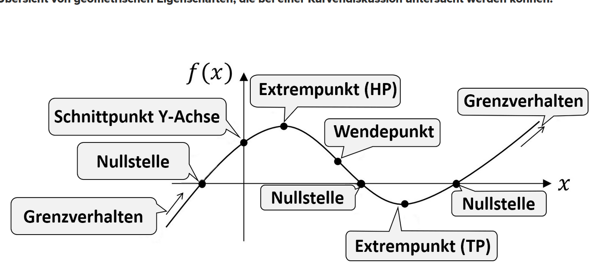

# Ableitung / Kurvendiskusion

## Regeln

### Ableitungen

|Funktion|Ableitung||
|:------|:-------:|---:|
|$f(x)$|$f'(x)$||
|$f(x) + g(x)$|f'(x) + g'(x)|Summen Regel|
|$f(x)g(x)$|$f '(x) g(x) + f(x) g'(x)$|Produkt Regel|
|$f(g(x))$|$f '(g(x)) g'(x)$|Ketten Regel|
|$\sin(x)$|$\cos(x)$||
|$\cos(x)$|$-\sin(x)$||
|$x^n$| $n \times x^{n − 1}$|Potenz Regel|

### Kurven Diskusion

## Beispiele

### allg

$$f(x)=5\\ f'(x)= 0$$

---

### Potenz Regel

$$f(x) =x^4+5\\ f'(x)=4x^3+0=4x^3$$

---

$$f(x) =x^{-4}\\ f'(x)=-4x^{-5}$$

---

### Summen Regel

$$f(x)= x + 5 + x +10\\ f'(x) = 1+0+1+0=2$$

---

### Produkt Regel

$$f(x) =3x^3 \times 2x^5$$

1) ableitung der einzelnen faktoren
    $$f(x)= 3x^3\\
    f'(x)=9x^2$$
    $$f(x) = 2x^5\\
    f'(x)=10x^4$$
2) Einsetzen in $f'(x)g(x)+f(x)g'(x)$
    $$f'(x)=9x^2\times2x^5+3x^3\times10x^4\\
    f'(x)=18x^7+30x^7=48x^7

---

### Ketten Regel

### 5.54 b)

$$
f(x)=x\times e^x\\
\text{0 Stelle}\\
0 = x \times e^x\\
ln(e^x)=ln(0)\\
\text{EQ}\\
f'(x)=e^x \times (1+x)+e^x \times 1\\
=e^x \times (1+x+1)\\
= e^x \times (x+2)\\
f'(-1)=e^{-1}\times(-1+2)\\
= e^{-1}=0,36 > 0\\
f(-1)= -1 \times e^{-1} = -0,36\\
f''(x)= e^x \times (x+3)\\
f''(x)=0\\
e^x \times (x+2)=-2
$$
